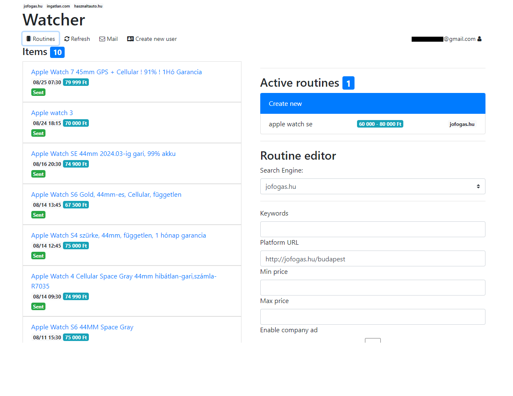

# Watcher

This application helps you to find "good deals" on different online sites.

Currently supported sites:

- jofogas.hu
- ingatlan.com
- hasznaltauto.hu

## How it works

Based on Routine you determine the application will scrape the desired sites and check if a new deal is available by the Routine requirements.
After collecting the deals the user gets notified several ways.

## Installation

1. Clone the repository:

```bash
git clone https://github.com/imdonix/jofogas-watcher.git
cd jofogas-watcher
npm i
```

2. [Optional] Create a new email account with [SMTP](https://en.wikipedia.org/wiki/Simple_Mail_Transfer_Protocol) support.

[!NOTE]
I recommend using [Zoho](mail.zoho.com), they provide custom domain names and full support for SMTP in their free plan.

3. [Optional] Check parameters with:

```bash
node ./app.js -h
```

3. Start the application. 

```bash
node ./app.js --mail_user <USER> --mail_pass <PASS> --mail_host <HOST> --mail_port <PORT>
```
4. Open `localhost:port` nad the password for the Admin user will be the same as `--mail_pass`

## Preview


